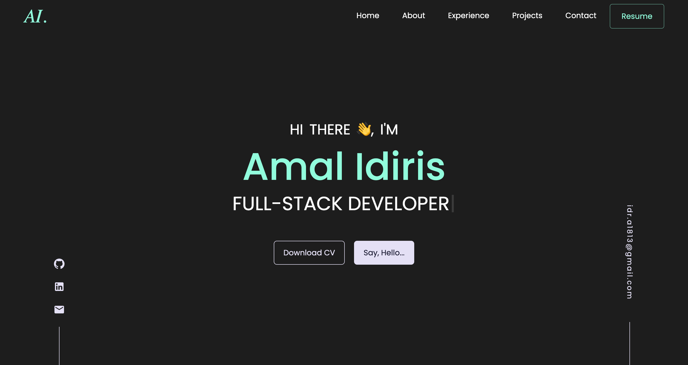

# My React Portfolio

## Description

Welcome to my portfolio!
The following application is a portfolio containing a number of my recent projects and showcasing the various technologies i have used, which I have built using React.

# Table of Contents

- [Deployed Application](#deployed-application)
- [Technologies](#technologies)
- [Screenshots](#screenshots)
- [Contact me](#contact-me)

# Deployed Application

- Click [here](https://amalidi.github.io/portfolio-react/) to view the deployed app.
- Click [here](https://github.com/Amalidi/portfolio-react/tree/main) to view the Github repo.

# Technologies

Project is created with:

- CSS
- HTML
- JavaScript
- React
- React Bootstrap
- React-router-dom
- React Icons
- material UI
- Github Pages

# Screenshots

The Homepage:

# Contact me

If you have any questions about this application, feel free to get in touch through :

- [My Email](mailto:A.idi12@outlook.com)
- [My Linkdin](https://github.com/Amalidi)
- [My Github](https://github.com/Amalidi)
